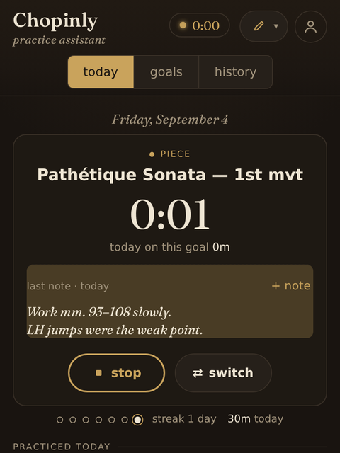
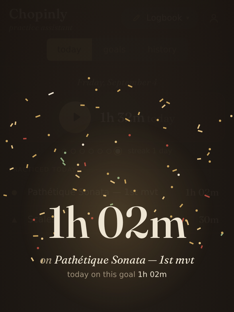
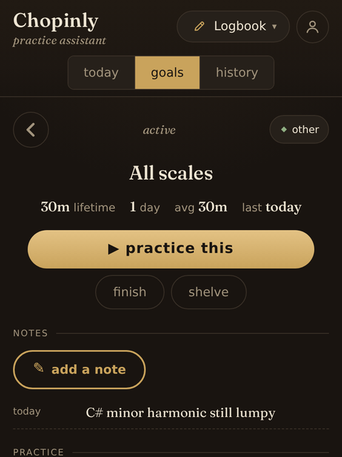
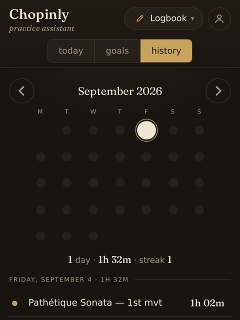
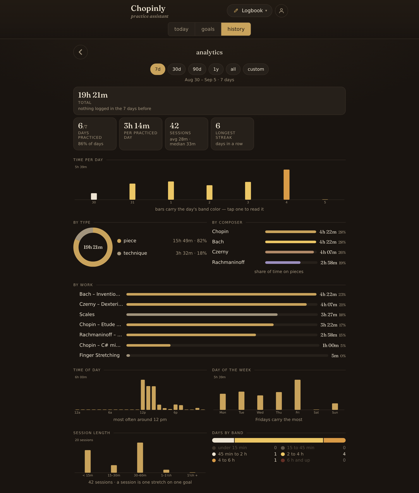
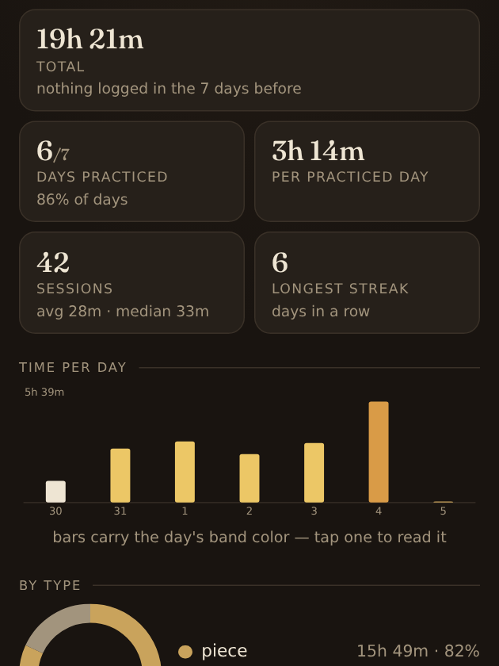
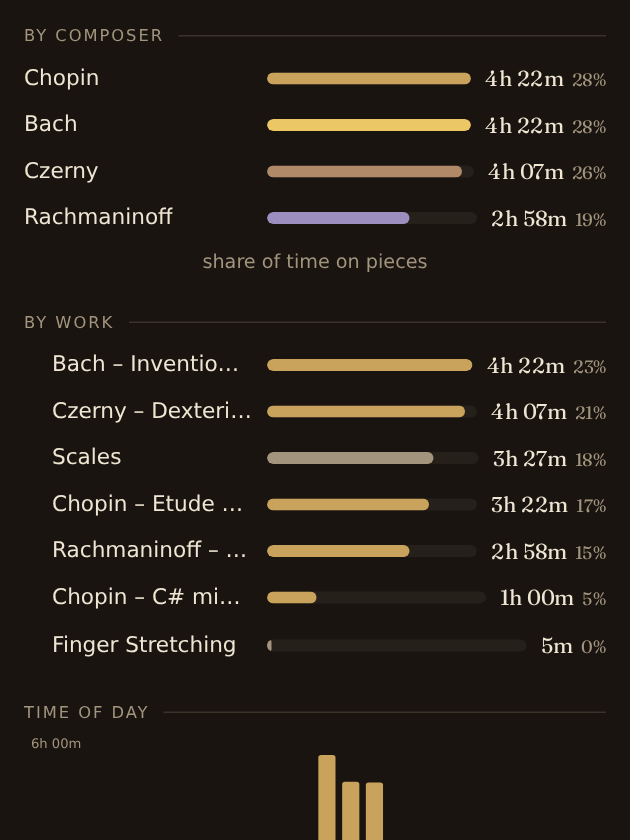

<p align="center">
  
</p>

<h1 align="center">Chopinly</h1>

<p align="center"><em>Choose something. Practice it. See what you actually did.</em></p>

<p align="center">
  <a href="https://chopinly.com"><b>chopinly.com</b></a> ·
  free · no ads · works offline · optional account for backup · no tracking
</p>

---

Chopinly is a practice assistant for musicians. You press play, say what you're
working on, and it keeps an honest record of your practice — minutes on each piece
and technique, a notes thread per goal, a calendar that shows the shape of your
months, and an analytics page that tells you how you really spend your time. It
also carries the tools you reach for while practicing: a metronome, a tuner, a
pitch pipe and sight-singing books.

It runs in the browser, installs to your phone's home screen like an app, and
works with no account at all. Nothing is sold, nothing is tracked, nothing is
behind a paywall.

## How a practice session goes

<table>
  <tr>
    <td width="25%"></td>
    <td width="25%"></td>
    <td width="25%"></td>
    <td width="25%"></td>
  </tr>
  <tr align="center">
    <td><em>practicing</em></td>
    <td><em>the bow, when you stop</em></td>
    <td><em>a goal</em></td>
    <td><em>history</em></td>
  </tr>
</table>

1. **Press play and pick a goal.** A goal is anything you practice: a piece
   (*Bach – Invention no. 8*), a technique (*Scales*), or something else (*Sight
   reading*). Type a name and it exists. Pieces carry a composer.
2. **Practice.** The clock runs on that goal. Switch goals mid-sitting and nothing
   is lost; the last note you wrote on that goal greets you so you pick up where
   your hands left off.
3. **Stop.** A short flourish shows what the sitting was worth, then the time lands
   in today's list and on the calendar. Forgot to press play? Hold the play button
   and add the minutes.
4. **Look back.** Each goal has its lifetime minutes, a tempo sparkline if you
   stamped tempos from the metronome, its notes, and every practiced day. History
   shows the month as a calendar of dots colored by how long you practiced each
   day, with a report for any day you tap.

## Analytics — how you really spend your time

<p align="center"></p>

<table>
  <tr>
    <td width="50%"></td>
    <td width="50%"></td>
  </tr>
</table>

Pick any range — a week, a month, a quarter, a year, everything, or two dates — and
the page recomputes: total time and how it compares with the period before, days
practiced, average session, longest streak; time per day, week or month; the split
by type, by composer and by work; what hour of the day and which weekdays carry the
load; how long your sessions tend to run; how many days landed in each practice
band. Tap a composer, a work or a type and every chart narrows to it.

The bands come from the research on deliberate practice and playing-related
injury: under 15 minutes, 15–45, 45 minutes to 2 hours, the 2–4 hour sweet spot,
4–6 hours of diminishing returns, and 6 hours and up. A day's dot wears its band's
color. Nothing is ever colored gold for merely beating yesterday — that would
reward the wrong thing.

## In the case

- **Metronome** — a pendulum that keeps honest time on the Web Audio clock:
  sample-accurate scheduling, four click voices, tap tempo, accents and mutes per
  beat, subdivisions, tempo markings. While a goal is running, one tap stamps the
  tempo onto it, so the goal page grows a tempo-over-time line.
- **Piano** — a keyboard under your thumbs: multitouch chords and glides, a
  sustain pedal, velocity from where you strike the key, and the computer
  keyboard plays it on a desk. Two octaves on a phone, up to four on a desk.
- **Tuner** — hear where you are: microphone pitch detection with a cents dial.
- **Pitch pipe** — any note, any octave, in tune, with A4 calibration.
- **Sight singing** — graded melodies on a real engraved staff, a tonic-chord
  count-in, then you sing them back and each note is judged for pitch and rhythm.
  Finished runs land in the logbook by themselves.
- **Logbook** — goals, the clock, notes, today, history, analytics.

## Your data is yours

Chopinly is **local first**. Without an account, everything lives in your browser
on your device and never leaves it. If you want a backup or a second device, sign
in with an email code — there is no password — and your practice syncs through a
small cloud account. From the account button you can download everything as a
file, sign out, clear a device, or delete the account and everything in it, all
in one tap.

There are no analytics scripts, no advertising, no third-party code and exactly
one cookie, set only when you sign in. Two companies help run the service:
Cloudflare (servers and database) and Mailgun (delivering the sign-in email).
The whole story, in plain English first:
[Privacy Policy](https://chopinly.com/privacy) ·
[Terms of Service](https://chopinly.com/terms) ·
[Cookie Policy](https://chopinly.com/cookies) ·
[Disclaimer](https://chopinly.com/disclaimer) ·
[About](https://chopinly.com/about).

## Install it

Open [chopinly.com](https://chopinly.com) on your phone and add it to the home
screen (Share → *Add to Home Screen* on iOS; the install prompt or ⋮ → *Install
app* on Android). It opens full-screen, works offline, and keeps the screen awake
while the clock runs.

## Open source

The code is public under the [Elastic License 2.0](LICENSE.md): use it, read it,
modify it, self-host it, build on it — just don't offer Chopinly itself to others
as a hosted service. Issues and pull requests are welcome. "Chopinly" and the mark
belong to LaLa Solutions LLC.

---

## For developers

### Run it

No build step — the repo is the site.

```bash
python3 -m http.server 8080      # the app alone, at http://localhost:8080
npm run dev                      # app + Pages Functions + local D1 (wrangler pages dev)
npm test                         # unit tests: node --test tests/*.test.mjs
```

For the account features locally, run `npm run db:migrate:local` once and put
`E2E_SECRET=…` and `DEV_ECHO_CODE=1` in `.dev.vars` (git-ignored) so sign-in codes
come back in the response instead of an email.

### How it's built

A static vanilla-ES-module PWA with a tool shell. A tool is
`{ id, name, glyph, mount(rootEl, ctx), unmount() }`; a new tool is one folder under
`js/tools/` plus one entry in `js/registry.js`, and the shell grows a menu entry.
The service worker precaches the shell under a versioned cache name — bump `CACHE`
in `sw.js` on every shipped change; idle pages reload onto the new worker.

- **Logbook data layer** — `js/lib/logbook.js`, pure and DOM-free: goals, segments,
  notes; every number is derived from segments, days are never stored. Practice
  bands, display names, the calendar, streaks.
- **Analytics** — `js/lib/analytics.js` (pure aggregation, unit-tested) and
  hand-drawn SVG in `js/tools/logbook/charts.js`; no chart library.
- **Accounts and sync** — Pages Functions in `functions/` at `/api/*`
  (`auth/code`, `auth/verify`, `auth/signout`, `me`, `me/export`, `sync`, `health`)
  over D1 (`wrangler.toml`, migrations in `migrations/`). The merge rule in
  `js/lib/merge.js` is imported by both the browser and the API so they agree by
  construction. Sign-in codes are salted hashes with a 10-minute life; sessions are
  hashed tokens in an HttpOnly cookie; `/api/sync` is rate-limited per user.
- **Landing and documents** — `welcome.html` + `css/welcome.css`; the OG image is
  rendered from `dev/og.html` by `node dev/render-og.mjs`; the legal pages are
  generated from one shell by `node dev/build-legal.mjs` (edit the generator, not the
  output — and every factual claim in them mirrors `functions/`).

Design and plan documents live in [`docs/`](docs/): [`DESIGN.md`](docs/DESIGN.md)
(palette, audio engine, shell), [`LOGBOOK_V2_DESIGN.md`](docs/LOGBOOK_V2_DESIGN.md)
(the practice model, screens, ceremonies, analytics),
[`ACCOUNTS_DESIGN.md`](docs/ACCOUNTS_DESIGN.md) (auth, sync protocol, privacy),
[`STAFF_DESIGN.md`](docs/STAFF_DESIGN.md) and [`MUSICAL_DESIGN.md`](docs/MUSICAL_DESIGN.md)
(sight singing).

### Tests

- Unit: `npm test` — the sight-singing judge, corpus and staff layout; the logbook
  model; the merge rule; analytics.
- End to end (Playwright): `tests/e2e/anonymous.mjs` (the whole app without an
  account), `accounts-sync.mjs` (two devices, one account, conflicts),
  `account-ui.mjs` (the account sheet), `landing.mjs` (landing, documents, first-run
  redirect). Run against `npm run dev` or production:

  ```bash
  E2E_SECRET=… BASE=https://chopinly.com SHOTS=/tmp/shots node tests/e2e/anonymous.mjs
  ```

### Deploy

Cloudflare Pages: `npm run deploy` (`npx wrangler pages deploy . --project-name
woodshed` — the Pages project keeps the app's original name, *Woodshed*). Secrets
on the project: `MAILGUN_KEY` and `E2E_SECRET`. Custom domains `chopinly.com` and
`www.chopinly.com` (www → apex is a client-side redirect in `index.html`, since
Pages `_redirects` can't match hostnames), plus the legacy alias
`metronome.apps.lalalimited.com`. The zone caches for four hours; verify a deploy
with `curl -H 'Cache-Control: no-cache'`.

Made by [LaLa Solutions LLC](mailto:leif@lalalimited.com).
